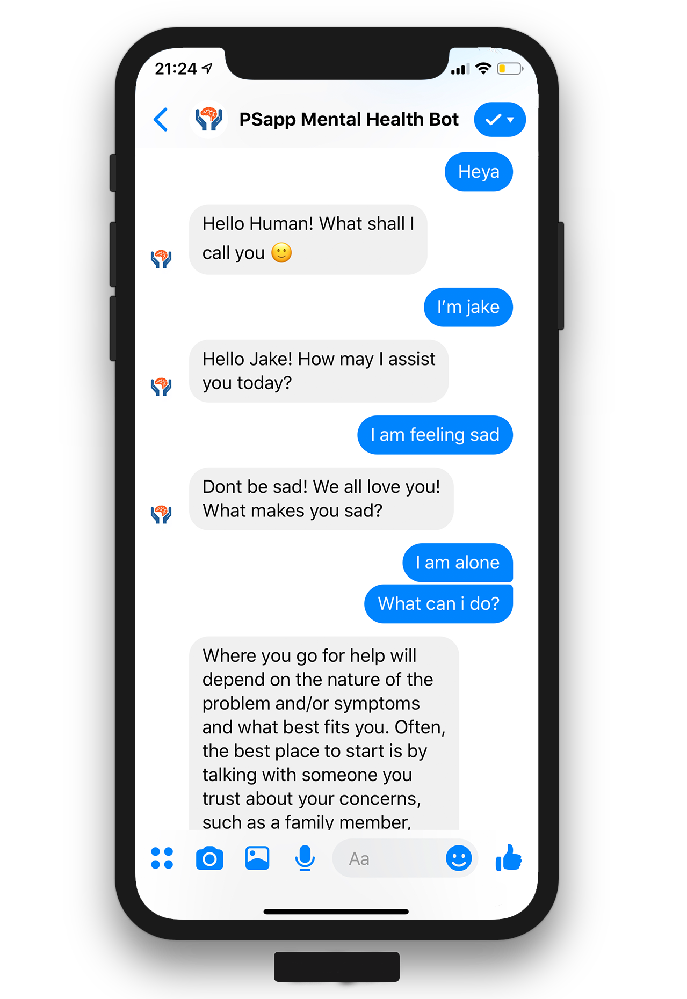

# PSapp Messenger Bot
This is a beta version Mental health messenger bot that can be created using Facebook Developer Console and Python. Dialogflow integration is optional.

## Usage
You will need to install requirements.txt using pip and also install ngrok if you want to use it on local

## Demo

## Contributing
I made this during a hackathon so it can be used as a boilerplate code for developing messenger bots. I'll add better documented bot repositories in future. Feel free to edit this though :)

## License
[MIT](https://choosealicense.com/licenses/mit/)